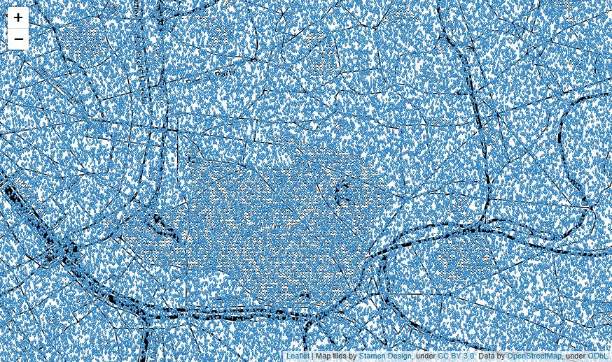

LeafletとPixi.jsを使って、Leaflet上にWebGLオーバーレイできるライブラリ、Leaflet.PixiOverlayを試しました。

[manubb/Leaflet.PixiOverlay: Bring Pixi.js power to Leaflet maps](https://github.com/manubb/Leaflet.PixiOverlay)


[](https://manubb.github.io/Leaflet.PixiOverlay/demo.html)


## Qiita

* [Leaflet.PixiOverlay その１マーカーの表示 - Qiita](https://qiita.com/sugasaki/items/cc50fe09a98fcd219719)

* [Leaflet.PixiOverlay その２many-markers - Qiita](https://qiita.com/sugasaki/items/9b6eb6ca70613b3d47e3)


## 実行方法


js/index.js の中のコメントを切り替えます。

```
//drawMarker();
manyMarker();
```

index.htmlをWebサーバーで実行する


